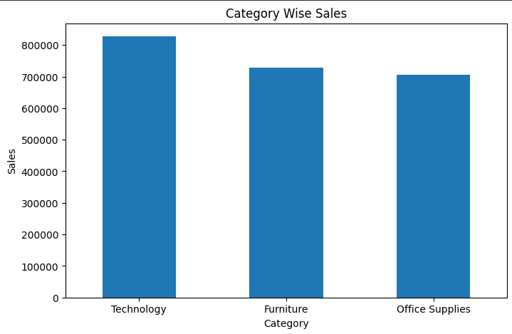
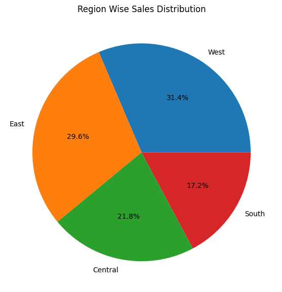
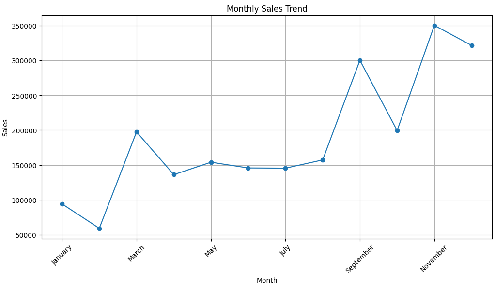
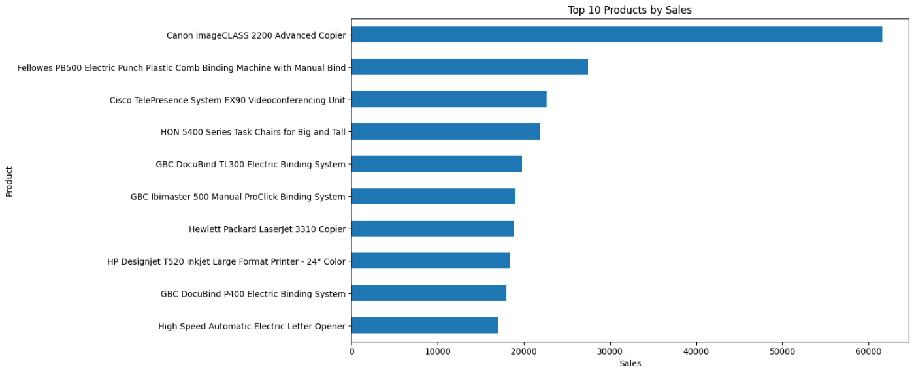

# 🛒 Superstore Sales Analysis Project


---

# 📌 Project Overview

This project focuses on analyzing Superstore retail sales data using Python.

The main goal of this project is to perform:
- Data Cleaning
- Exploratory Data Analysis (EDA)
- Business Insights Generation
- Sales Trend Analysis
- Customer Analysis
- Product Performance Analysis
- Data Visualization

This project demonstrates practical Data Analyst skills using real-world retail data.

---

# 🚀 Technologies Used

- Python
- Pandas
- NumPy
- Matplotlib
- Google Colab

---

# 📂 Dataset Information

Dataset used:
- Superstore Retail Dataset

Dataset contains:
- Orders
- Customers
- Products
- Categories
- Regions
- States
- Shipping Details
- Sales Information

---

# 📊 Analysis Performed

## ✅ Data Cleaning
- Removed duplicate records
- Checked missing values
- Converted date columns
- Created Month and Year columns

---

## ✅ Exploratory Data Analysis

### Category Wise Sales Analysis
Analyzed sales generated by each product category.

### Sub-Category Analysis
Identified top-performing and low-performing sub-categories.

### Region Wise Sales Analysis
Compared sales across different regions.

### State Wise Sales Analysis
Found highest revenue generating states.

### Product Performance Analysis
Identified top-selling products.

### Customer Analysis
Analyzed top customers contributing to revenue.

### Monthly Sales Trend
Analyzed monthly sales patterns and trends.

### Ship Mode Analysis
Compared sales across different shipping methods.

---

# 📈 Visualizations Included

- Bar Charts
- Pie Charts
- Line Charts
- Horizontal Bar Charts

---

# 📷 Project Screenshots

## Category Wise Sales


---

## Region Wise Sales Distribution


---

## Monthly Sales Trend


---

## Top Products Analysis


---

# 💡 Key Business Insights

- Technology category generated highest sales
- Certain states contributed major revenue
- Monthly sales showed seasonal trends
- Some products significantly outperformed others
- Standard Class shipping mode was most preferred

---

# 🧠 Skills Demonstrated

- Data Cleaning
- Exploratory Data Analysis (EDA)
- Data Visualization
- Business Analytics
- Insight Generation
- Python Programming
- Problem Solving

---

# 📁 Project Structure

```text
superstore-sales-analysis/
│
├── Superstoredataset.csv
├── superstore-sales-analysis.ipynb
├── README.md
│
└── images/
    ├── category-sales.png
    ├── region-sales.png
    ├── monthly-sales.png
    └── top-products.png
```

---

# ▶️ How to Run This Project

1. Open the notebook in Google Colab
2. Upload the dataset
3. Run all cells step-by-step
4. Explore the visualizations and insights

---

# 📌 Future Improvements

- Create interactive Power BI dashboard
- Add profit and discount analysis
- Build sales forecasting model
- Add advanced statistical analysis

---

# 👩‍💻 Author

## Komal Margale

Aspiring Data Analyst | Python Enthusiast | UI/UX Designer

---

# ⭐ If You Like This Project

Give this repository a star ⭐
